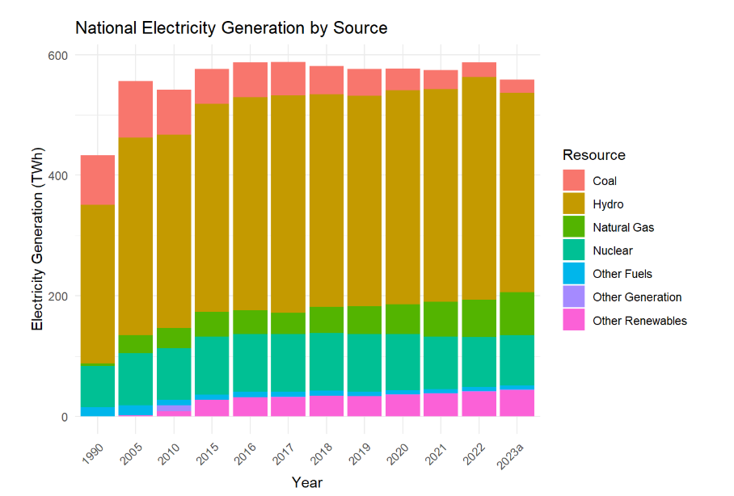
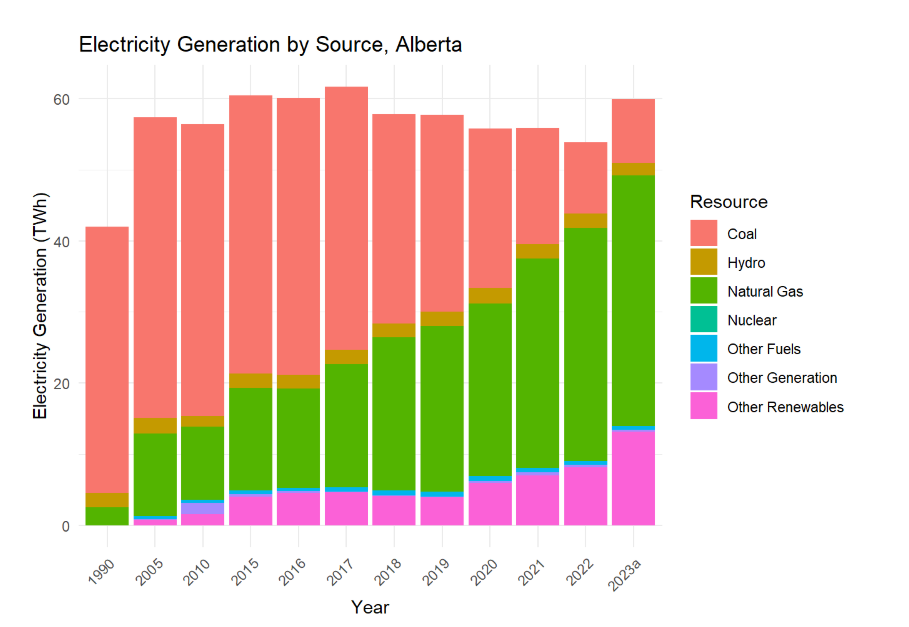
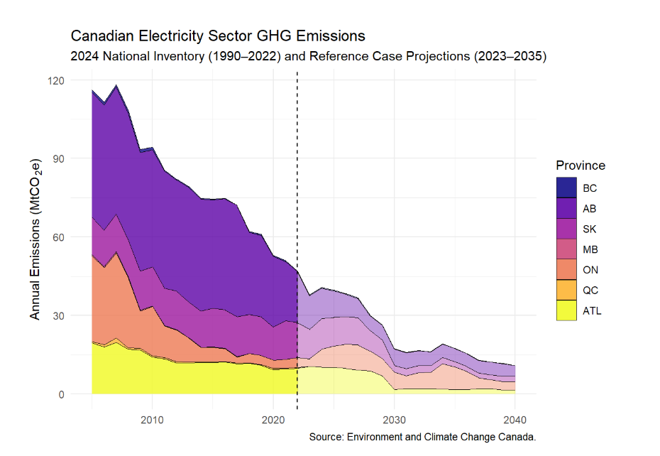
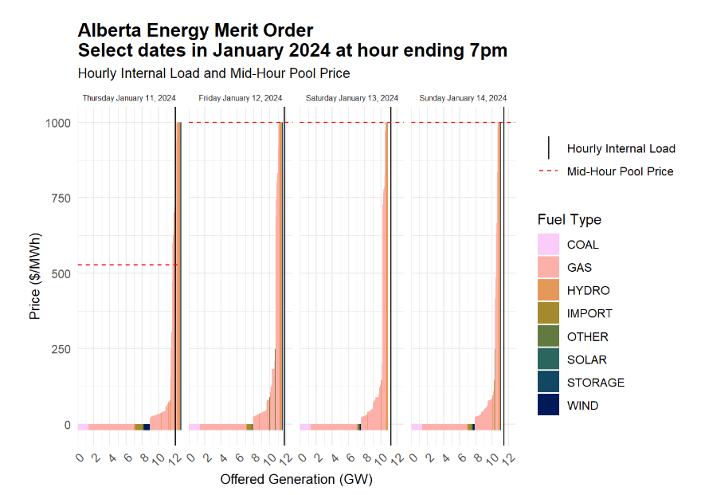

# Canadian Electricity Emissions And Merit Order

This project was completed as part of ECON 366 (Energy Economics) at the University of Alberta. It combines GHG inventory data, emissions projections, and electricity generation data for Canada and Alberta, with a special focus on data visualization and comparative analysis. It concludes with a stylized merit order chart of Alberta's power market.

## Deliverables

### 1. National Electricity Generation by Source (1990–2023)
Visualized electricity generation (in TWh) by fuel source for Canada.

---

### 2. Alberta Electricity Generation by Source (1990–2023)
Comparison of Alberta’s generation portfolio across the same period.

---

### 3. Canadian Electricity Sector GHG Emissions
Combines 2024 National Inventory (1990–2022) and Reference Case projections (2023–2035) by province.

---

### 4. Alberta Merit Order: Select Dates in January 2024
Stacked merit order chart showing the offered generation (GW) by fuel type at hour ending 7pm, with internal load and pool price lines.

---

## Tools Used

- **R** (tidyverse, ggplot2, cowplot, viridis, scico, lubridate)
- **Data Sources**:
  - Environment and Climate Change Canada
  - Alberta Electric System Operator (AESO)
  - Official National Inventory Reports

